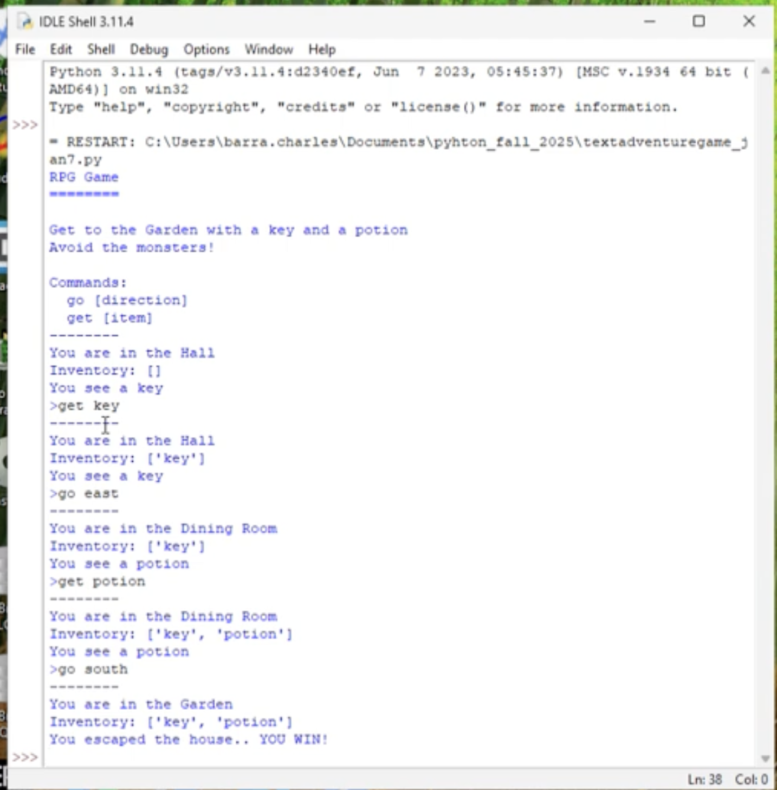

# Text Adventure Game

A small console game where the player explores rooms, collects two items, and tries not to walk into the monster.

[View my programming portfolio](https://charliebarra.github.io/portfolio/programming.html)



## The Question

Could I make a game using only text, rooms, and player choices?

## What I Built

I built most of this in about a day. The player moves between four connected rooms, checks the room for an item, and can add that item to an inventory. Getting the key and potion before reaching the garden wins the game. Entering the kitchen ends it a little faster than planned because that is where the monster is.

The inventory system is the part I am weirdly proud of. It was an early example of making the program remember something the player had already done.

## How It Works

- A nested dictionary stores each room, its exits, and any item inside it.
- `current_room` tracks the player's location.
- A list stores the player's inventory.
- The command loop accepts `go [direction]` and `get [item]`.
- Conditional checks decide whether the player wins, meets the monster, or keeps exploring.

## Something That Surprised Me

The inventory remembers that I picked up an item, but the room does not. In this version, the item stays listed in the room and can be picked up again. Looking back, that is the clearest thing I would rewrite: picking something up should change both the inventory and the room.

## What I Would Change Next

I would remove collected items from their rooms and add more rooms to explore.

## Run It

This project uses Python 3 and no external packages.

```bash
python3 src/textadventuregame_jan7.py
```

The game explains its commands when it starts.

## Files

- `src/textadventuregame_jan7.py` — original source code, preserved unchanged
- `images/adventure-game-screenshot.png` — original gameplay screenshot
- `SOURCE-INTEGRITY.md` — checksum for verifying the source file

## Source Integrity

The original source is intentionally unchanged. The awkward parts are useful evidence too: they show what I understood then and what I would improve now.
